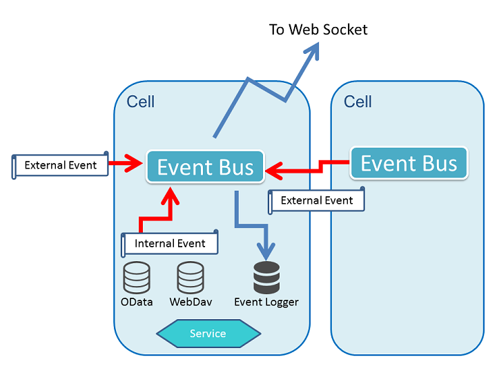

# Event model
## Overview
It consists of an external event defined by [event reception API](278 _ Event _ Reception.md) and an internal event defined within Personium.




#### External event
Represents an event to be accepted in [Event reception API](278 _ Event _ Reception.md).
An event is generated by the event reception API, and the accepted event is output to the event bus.
In the future, it will be possible to relay the reception of events to other cells. In case
#### Internal Event
Indicates processing that is executed based on the state of management data (OData / WebDAV / Service, etc.) held inside Personium.
As a typical internal event, there is a request of Personium API.
When the response of the Personium API is returned, the execution result is output as an event to the event bus.

## Processing events
It is judged whether or not the event outputted to the event bus matches the condition of the rule, and if it matches, the action described in the rule is executed.
For the action, you can specify:
* Log output
* Script execution
* Event relay

### Event log format
The output format is as follows.
```
{dateTime},[{level}],{RequestKey},{external},{schema},{subject},{type},{object},{info}
```

### Event log access method
Since the event log is managed on the WebDAV, access to the event log file is done with the API for WebDAV.
* [Get log file list](284_Retrieve_Log_File_list.md)
* [Get log file](285_Retrieve_Log_File.md)
* [Delete Log File](286_Delete_Log_File.md)

### Event log retention period
Since the size of the event log file increases according to the event amount, the event log file is rotated by a fixed amount.
The number of generation generations of the rotated event log file is 12 generations maximum.
The maximum size at rotation is set to 50 MB by default, and it can be set by the log setting update API.
### Output example
#### External event output example
```
2013-04-18T14:52:39.778Z,[ERROR],"Req_animal-access_1001","true",
"https://{UnitFQDN}/appCell/","https://{UnitFQDN}/servicemanager/#admin","actionData",
"/svc/token_keeper","resultData"
2013-04-18T14:52:40.688Z,[INFO ],"Req_animal-access_2001","true",
"https://{UnitFQDN}/appCell/","https://{UnitFQDN}/servicemanager/#admin","action",
"/svc/token_keeper","result"
2013-04-18T15:01:46.994Z,[INFO ],"Req_animal-access_2001","true",
"https://{UnitFQDN}/appCell/","https://{UnitFQDN}/servicemanager/#admin","action",
"/svc/token_keeper","result"
2013-04-18T15:06:19.294Z,[ERROR],"Req_animal-access_1001","true",
"https://{UnitFQDN}/appCell/","https://{UnitFQDN}/servicemanager/#admin","actionData",
"/svc/token_keeper","resultData"
2013-04-18T15:06:23.360Z,[INFO ],"Req_animal-access_2001","true",
"https://{UnitFQDN}/appCell/","https://{UnitFQDN}/servicemanager/#admin","action",
"/svc/token_keeper","result"
2013-04-18T15:09:18.073Z,[ERROR],"Req_animal-access_1001","true",
"https://{UnitFQDN}/appCell/","https://{UnitFQDN}/servicemanager/#admin","actionData",
"/svc/token_keeper","resultData"
```
#### Example of internal event output
```
2013-04-18T14:52:39.779Z,[INFO ],"Req_animal-access_1001","false",
"https://{UnitFQDN}/appCell/","https://{UnitFQDN}/appCell/#staff","odata.update",
"https://{UnitFQDN}/homeClinic/box/col/put_blog","204"
2013-04-18T14:52:39.780Z,[INFO ],"Req_animal-access_1001","false",
"https://{UnitFQDN}/appCell/","https://{UnitFQDN}/appCell/#staff","odata.get",
"https://{UnitFQDN}/homeClinic/box/col/blog_20130418","200"
```
