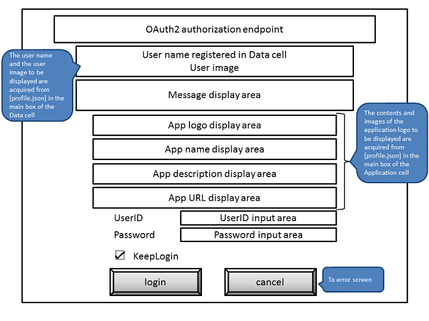

# OAuth2.0 Authorization Endpoint(\_\_authz)

### Overview

OAuth2 Authorization Endpoint<br>
This API is the OAuth2 authorization endpoint, for utilizing the Personium on JS application and native application\\.

### Required Privileges

None

### Precondition

In order to execute this API, it is necessary to prepare in advance Box which has the application cell URL in the schema\\.

### Restrictions

Request query, specification of "p\_target" parameter of request body is not supported

* When p_target is specified, an error occurs in nginx because the value of "Location" in the response header exceeds 4,096 characters.
* Internet Explorer can not redirect correctly because the maximum URL length is limited to 2048 characters.

<br>

### Request

#### Request URL

```
{CellName}/__authz
```

#### Request Method

GET : Authentication form request<br>
POST : Authentication form request, Authentication Token

#### Request Query

|Item Name<br>|Overview<br>|Format<br>|Required<br>|Effective Value<br>|
|:--|:--|:--|:--|:--|
|response_type<br>|Response Type<br>|String<br>|Yes<br>|Token<br>|
|client_id<br>|Application Cell URL<br>|String<br>|Yes<br>|Application Cell URL of authentication form request<br>|
|redirect_uri<br>|Client redirect endpoint URL<br>|String<br>|Yes<br>|URL of the redirect script registered under the default BOX of the application cell<br>Query parameters formatted with application/x-www-form-urlencoded can be included<br>It is not possible to include fragments<br>Effective digit length:512byte<br>|
|state<br>|Random value used to maintain state between request and callback<br>|String<br>|No<br>|Random value<br>Effective digit length:512byte<br>|
|p_target<br>|Transcell token target<br>|String<br>|No<br>|Cell URL using token to be paid out<br>When specified, pays out a transcell token<br>|
|p_owner<br>|ULUUT Execute promotion Query<br>|String<br>|No<br>|Valid only for true<br>* When this query is set, authentication information is not returned as cookie<br>|
|assertion<br>|Access token<br>|String<br>|No<br>|A valid TransCell token<br>In the case of no argument, it does not become token authentication<br>|
|username<br>|User name<br>|String<br>|No<br>|Registered user name<br>|
|password<br>|Password<br>|String<br>|No<br>|Registered password<br>|

#### Request Header

None

#### Request Body

Same as request query

#### Request Sample

None

<br>

### Response

#### Forms Authentication Request

##### Response Code

200

##### Response Header

|Header Name<br>|Overview<br>|Notes<br>|
|:--|:--|:--|
|Content-Type<br>|Content-Type of Resource<br>|<br>|

##### Response Body

Return the following HTML form.<br>

##### Error Messages

Refer to [Error Message List](004_Error_Messages.html)

##### Response Sample

None

#### Request Token Authentication

##### Response Code

302<br>
The browser is redirected to redirect\_uri. A fragment indicated by "URL parameter" is stored in redirect\_uri.

```
{redirect_uri}#access_token={access_token}&token_type=Bearer&expires_in={expires_in}&state={state}
```

|Item Name<br>|Overview<br>|Notes<br>|
|:--|:--|:--|
|redirect_uri<br>|Client redirect endpoint URL<br>|The value of "redirect_uri" in the request<br>|
|access_token<br>|Access token acquired in the authentication/authorization request form<br>|Return cell local token or transcell token<br>|
|token_type<br>|Bearer<br>|<br>|
|expires_in<br>|Expiration date of "access_token"<br>|1 hour (3600 seconds)<br>|
|state<br>|Value of state set at the time of request<br>|Random value used to maintain state between request and callback<br>|

##### Error Messages

|Item Name<br>|Overview<br>|Notes<br>|
|:--|:--|:--|
|redirect_uri<br>|Redirect URL<br>|The URL of the client's redirect split<br>specified by the "redirect_uri" of the request<br>However, in the case of the following error contents, this value is set to "cell URL + __html/error"<br>"Redirect_uri is not in URL format" "cell in client_id and redirect_uri is different"<br>|
|error<br>|Code indicating error content<br>|See "error"<br>|
|error_description<br>|Additional information on errors<br>|Set exception message etc<br>|
|error_uri<br>|Web page URI of additional information on error<br>|Return empty string<br>* Set for future enhancemen<br>|
|state<br>|Value of state set at the time of request<br>|<br>|
|code<br>|Personium error code<br>|<br>|
|invalid_request<br>|A required parameter is not specified in the request<br>Invalid request parameter format<br>Account locked<br>|<br>|
|unauthorized_client<br>|The client is not authorized<br>Cancel button pressed by user<br>|<br>|
|access_denied<br>|The cells of client_id and redirect_uri are different<br>When transcell token authentication fails<br>|<br>|
|unsupported_response_type<br>|Invalid value of response_type<br>|<br>|
|server_error<br>|Server Error<br>|<br>|
|Please, input user ID and password.<br>|"Username" or "password" has not been entered<br>|<br>|
|User ID or password is incorrect.<br>|When password authentication fails<br>|<br>|
|Since the Expiration Date of the authentication passed,<br>You must be authorized again.<br>|Cookie authentication failed<br>|<br>|

##### Parameter Check Error

The browser is redirected to redirect\_uri.<br><br>
"Redirect\_uri is not in URL format" "cell in client\_id and redirect\_uri is different" "Authorization processing failure"

```
{redirect_uri}?code={code}
```

Other than those above

```
{redirect_uri}#error={error}&error_description={error_description}&state={state}&code={code}
```

<br>

### cURL Command

#### GET

```sh
curl "https://{UnitFQDN}/{CellName}/__authz?response_type=token&redirect_uri=https://{UnitFQDN}/{AppliCellName}/__/redirect.html&client_id=https://{UnitFQDN}/{AppliCellName}" -X GET -i
```

#### POST

```sh
curl "https://{UnitFQDN}/{CellName}/__authz" -X POST -i -d 'response_type=token&client_id=https://{UnitFQDN}/{AppliCellName}&redirect_uri=https://{UnitFQDN}/{AppliCellName}/__/redirect.html&state=0000000111&username={AccountUserName}&password={AccountUserPass}'
```

<br><br><br><br><br>

###### Copyright 2017 FUJITSU LIMITED