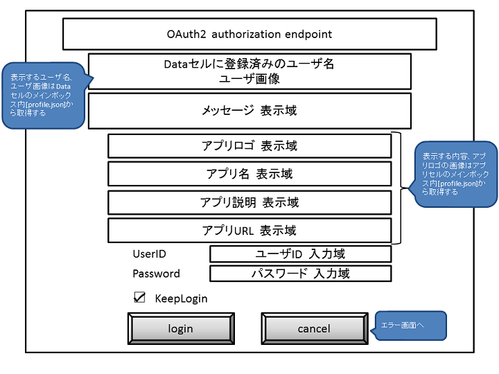

# OAuth2.0 認可エンドポイント(\__authz)
### 概要
OAuth2の認可エンドポイントAPI  
このAPIは、JSアプリケーション・ネイティブアプリでPersoniumを利用する場合のOAuth2の認可エンドポイントである。
### 必要な権限
なし
### 前提条件
このAPIを実行するためには、アプリセルURLをスキーマに持つBoxを事前に作成しておく必要がある。
### 制限事項
リクエストクエリ、リクエストボディの「p_target」パラメータの指定は未サポート
* p_targetを指定した場合、レスポンスヘッダの「Location」の値が4,096文字を超えるため、nginxでエラーとなる。
* Internet Explorerでは、URLの最大長が2,048文字に制限されているため、正しくリダイレクトできない。

<br>
### リクエスト
#### リクエストURL
```
{CellName}/__authz
```
#### メソッド
GET : 認証フォーム リクエスト
POST : 認証フォーム リクエスト、トークン認証  
#### リクエストクエリ
|項目名<br>|概要<br>|書式<br>|必須<br>|有効値<br>|
|:--|:--|:--|:--|:--|
|response_type<br>|応答タイプ<br>|String<br>|○<br>|トークン<br>|
|client_id<br>|アプリセル URL<br>|String<br>|○<br>|スキーマ認証元のアプリセルURL<br>|
|redirect_uri<br>|クライアントのリダイレクトエンドポイントURL<br>|String<br>|○<br>|アプリセルのデフォルトBOX配下に登録されたリダイレクトスクリプトのURL<br>application/x-www-form-urlencodedでフォーマットされたクエリパラメータを含める事ができる<br>フラグメントを含める事はできない<br>有効桁長:512byte<br>|
|state<br>|リクエストとコールバックの間で状態を維持するために使用するランダムな値<br>|String<br>|×<br>|ランダムな値<br>有効桁長:512byte<br>|
|p_target<br>|トランスセルトークンターゲット<br>|String<br>|×<br>|払い出されるトークンを使うセルURL<br>指定した場合トランスセルトークンを払い出す<br>|
|p_owner<br>|ULUUT昇格実行クエリ<br>|String<br>|×<br>|trueのみ有効<br>※このクエリを設定した場合、認証情報はCookieで返却されない<br>|
|assertion<br>|アクセストークン<br>|String<br>|×<br>|有効なトランスセルトークン<br>引数なしの場合トークン認証にはならない<br>|
|username<br>|ユーザ名<br>|String<br>|×<br>|登録済のユーザ名<br>|
|password<br>|パスワード<br>|String<br>|×<br>|登録済のパスワード<br>|
#### リクエストヘッダ
なし
#### リクエストボディ
リクエストクエリと同じ
#### リクエストサンプル
なし

<br>
### レスポンス
#### Forms Authentication Request
##### ステータスコード
200
##### レスポンスヘッダ
|ヘッダ名<br>|概要<br>|備考<br>|
|:--|:--|:--|
|Content-Type<br>|Content-Type of Resource<br>|<br>|
##### レスポンスボディ
以下のHTMLフォームを返却する。


##### エラーメッセージ一覧
[エラーメッセージ一覧](004_Error_Messages.html)を参照

##### レスポンスサンプル
なし
#### Request Token Authentication
##### ステータスコード
302  
ブラウザはredirect_uriにリダイレクトされる。redirect_uriに、「URLパラメータ」で示すフラグメントが格納される。
```
{redirect_uri}#access_token={access_token}&token_type=Bearer&expires_in={expires_in}&state={state}
```
|項目名<br>|概要<br>|備考<br>|
|:--|:--|:--|
|redirect_uri<br>|クライアントのリダイレクトエンドポイントURL<br>|リクエストの「redirect_uri」の値<br>|
|access_token<br>|認証・認可要求フォームで取得したアクセストークン<br>|セルローカルトークンもしくは、トランスセルトークンを返却する<br>|
|token_type<br>|Bearer<br>|<br>
|expires_in<br>|上記「access_token」の有効期限<br>|1時間（3600秒）<br>|
|state<br>|リクエスト時に設定したstateの値<br>|リクエストとコールバックの間で状態を維持するために使用するランダムな値<br>|
##### エラーメッセージ一覧
|項目名<br>|概要<br>|備考<br>|
|:--|:--|:--|
|redirect_uri<br>|Redirect URL<br>|リクエストの「redirect_uri」で指定された、<br>クライアントのリダイレクトスプリクトのURL<br>ただし、以下のエラー内容の場合はこの値は「セルのURL + __html/error」に設定される<br>「redirect_uriがURL形式ではない」「client_idとredirect_uriのセルが異なる」<br>|
|error<br>|エラー内容を示すコード<br>|「error」を参照<br>|
|error_description<br>|エラーの追加情報<br>|例外メッセージなどを設定する<br>|
|error_uri<br>|エラーの追加情報のWebページのURI<br>|空文字を返す<br>※今後のエンハンスに備えて設定<br>|
|state<br>|リクエスト時に設定したstateの値<br>|<br>|
|code<br>|Personiumのエラーコード<br>|<br>|
|invalid_request<br>|リクエストで必須パラメータが指定されていない<br>リクエストパラメータの形式が不正<br>アカウントロック中<br>|<br>|
|unauthorized_client<br>|クライアントが認可されていない<br>ユーザによってキャンセルボタンが押下された<br>|<br>|
|access_denied<br>|client_idとredirect_uriのセルが異なる<br>トランスセルトークン認証に失敗した場合<br>|<br>|
|unsupported_response_type<br>|response_typeの値が不正<br>|<br>|
|server_error<br>|サーバエラー<br>|<br>|
|Please, input user ID and password.<br>|「username」もしくは「password」が未入力<br>|<br>|
|User ID or password is incorrect.<br>|パスワード認証に失敗した場合<br>|<br>|
|Since the Expiration Date of the authentication passed,<br>You must be authorized again.<br>|Cookie認証に失敗した場合<br>|<br>|
##### Parameter Check Error
ブラウザはredirect_uriにリダイレクトされる。<br>
「redirect_uriがURL形式ではない」「client_idとredirect_uriのセルが異なる」「認可処理失敗」
```
{redirect_uri}?code={code}
```

上記以外
```
{redirect_uri}#error={error}&error_description={error_description}&state={state}&code={code}
```

<br>
### CURLサンプル
#### GET
```sh
curl "https://{UnitFQDN}/{CellName}/__authz?response_type=token&redirect_uri=https://{UnitFQDN}/{AppliCellName}/__/redirect.html&client_id=https://{UnitFQDN}/{AppliCellName}" -X GET -i
```
#### POST
```sh
curl "https://{UnitFQDN}/{CellName}/__authz" -X POST -i -d 'response_type=token&client_id=https://{UnitFQDN}/{AppliCellName}&redirect_uri=https://{UnitFQDN}/{AppliCellName}/__/redirect.html&state=0000000111&username={AccountUserName}&password={AccountUserPass}'
```
<br>
<br>
<br>
###### Copyright 2017    FUJITSU LIMITED
